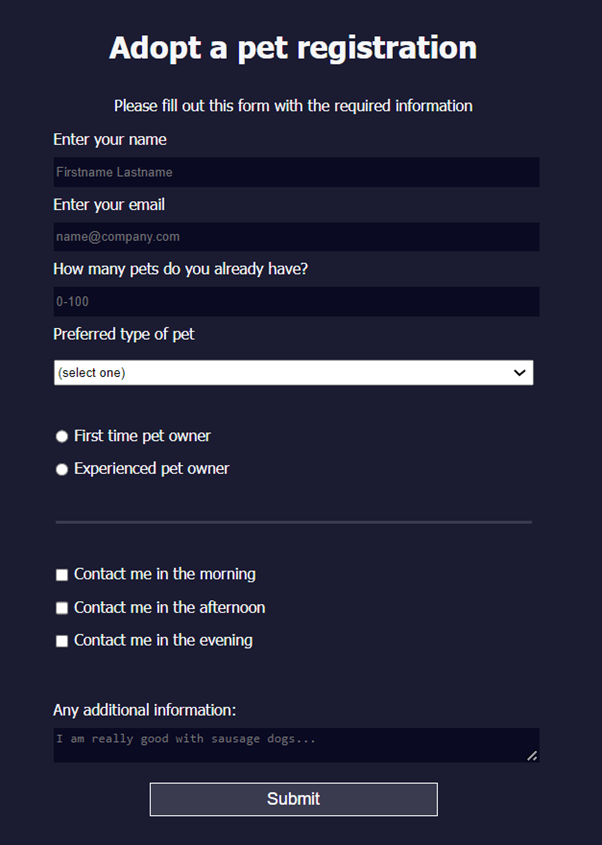

# Registration form

This is a registration form I created to learn about HTML and CSS.

It is the first project in the FreeCodeCamp Responsive Web Design course where you are given a set of tests and you have to write HTML and CSS to get the tests to pass. 

I learnt about different form elements including:
- inputs
- ids
- fieldsets
- radio buttons
- checkboxes
- select
- free text area
- buttons

## Pet registration form

